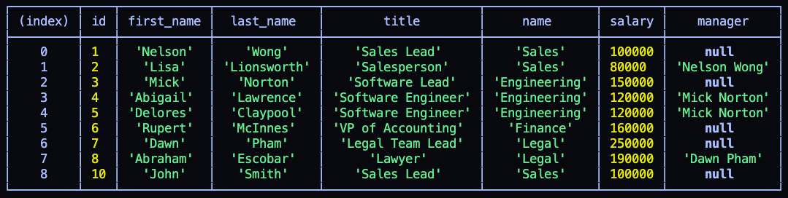

# Employee-Tracker CMS

## Table of Contents

* [Description](#description)
* [Screenshot](#screenshot)
* [Contributions](#contributions)
* [License](#license)

## Description

A simple—but powerful—CMS that allows admins to easily view staff together, by department or by title. Also allows for the addition of new departments, roles and employees. Finally, it's possible to update an existing employee's job title.

Built with Inquirer NPM package and MySQL tables.

## Screenshot

## Contributions

Many thanks to my patient classmates and tutor.

## License

MIT License

Copyright (c) 2020 Andrew Stewart

